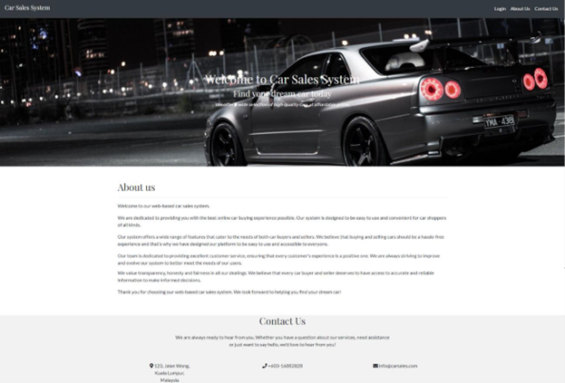

# 🚗 Web-based Car Sales System

This project is a **Java-based web application** developed as part of the *Enterprise Programming for Distributed Applications* module. It simulates a full-featured Car Sales System designed for managing staff, salespeople, customers, and transactions across a distributed architecture.

## 📌 Overview

The Car Sales System is built using the **MVC (Model-View-Controller)** pattern with **Java Servlets**, **JSP**, and **MySQL**, supported by **Bootstrap** and **JavaScript** for an interactive UI. It features role-based access for Managing Staff, Salesman, and Customers, allowing for a dynamic and secure car sales environment.

## 👥 User Roles & Functionalities

### 1. 👨‍💼 Managing Staff
- View, add, edit, delete records for **Staff**, **Salesmen**, **Customers**, and **Cars**
- Analyze reports with 5 dynamic charts:
  - Payment Report
  - Feedback Report
  - Gender Report
  - Customer & Salesman Stats
  - Inventory Status
- Manage car inventory, approve accounts, and view transaction records via modal windows

### 2. 🧑‍💼 Salesman
- Register and await approval
- View and update own profile
- Book cars on behalf of customers
- Manage bookings: Set cars as **Booked**, **Paid**, or **Cancelled**
- View individual sales records

### 3. 👤 Customer
- Register and await approval
- View and edit profile
- View **Available Cars**
- Track **Pending Transactions** and **Purchase History**
- Submit feedback and ratings for purchased cars

---

## 🧱 System Architecture

### 📐 MVC Architecture

- **Model**: Business logic and database interaction (JDBC, EJB)
- **View**: JSP files styled with Bootstrap
- **Controller**: Java Servlets handling request-response logic


---

## 🗂️ Features Summary

| Feature | Managing Staff | Salesman | Customer |
|--------|----------------|----------|----------|
| Role-based login & registration | ✅ | ✅ | ✅ |
| Profile editing | ✅ | ✅ | ✅ |
| Approvals | ✅ | Wait for approval | Wait for approval |
| View/Add/Edit/Delete records | ✅ | ❌ | ❌ |
| Book cars for customer | ❌ | ✅ | ❌ |
| View sales/purchase records | ✅ | ✅ | ✅ |
| Leave feedback | ❌ | ❌ | ✅ |
| Chart reporting | ✅ | ❌ | ❌ |

---

## 💻 Technologies Used

- **Java** (Servlets, JSP)
- **MySQL** (Relational database)
- **Bootstrap** (Front-end styling)
- **JavaScript & JQuery** (Client-side interactions)
- **Apache Tomcat** (Server deployment)
- **Lombok** (Boilerplate-free data classes)
- **Chart.js** (Graphical reports)

---

## 🗃️ Database Design

- Designed with **ERD** (Entity Relationship Diagram)
- Supports tables for `staff`, `salesman`, `customers`, `cars`, `transactions`, `feedback`, etc.
- Data validations and constraints applied on all fields

---

## 📊 Reporting Modules

- Interactive charts built using **Chart.js**:
  - Inventory analysis
  - Sales and feedback analysis
  - Gender demographics
- Transaction reports using modal tables with advanced filtering and sorting

---

## 🛠️ Installation & Running Steps

1. Clone the repository:
   ```bash
   git clone https://github.com/wonghorngwoei/CarSalesSystem

2. Import the project into an IDE (like IntelliJ or Eclipse) with Java EE support

3. Setup MySQL database with the provided SQL script

4. Configure web.xml and database connection files

5. Deploy to Apache Tomcat

6. Access the app at: http://localhost:8080/car-sales-system

## 📸 Screenshots

### 🖥️ Dashboard (Managing Staff)


## 🧠 Learning Outcomes
- Gained experience in enterprise-level application design

- Implemented MVC architecture and role-based authentication

- Designed and deployed a complete system with reporting, chart analytics, and multi-user support

- Improved skills in Java EE, MySQL, JSP/Servlet, and Bootstrap